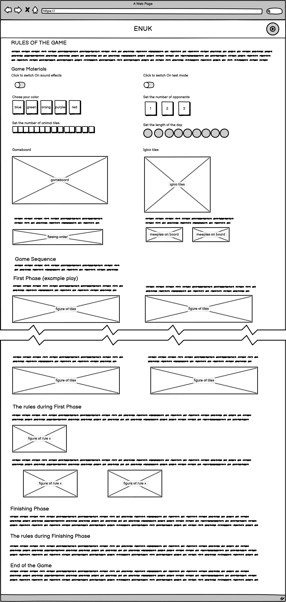
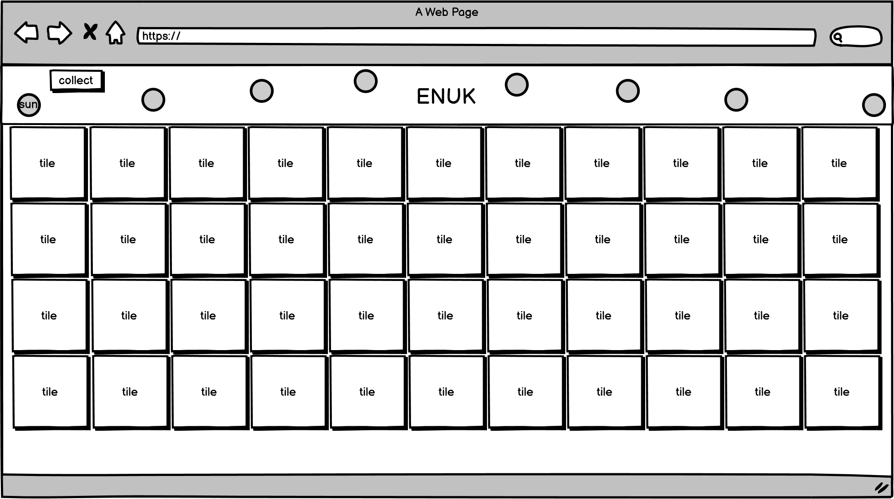
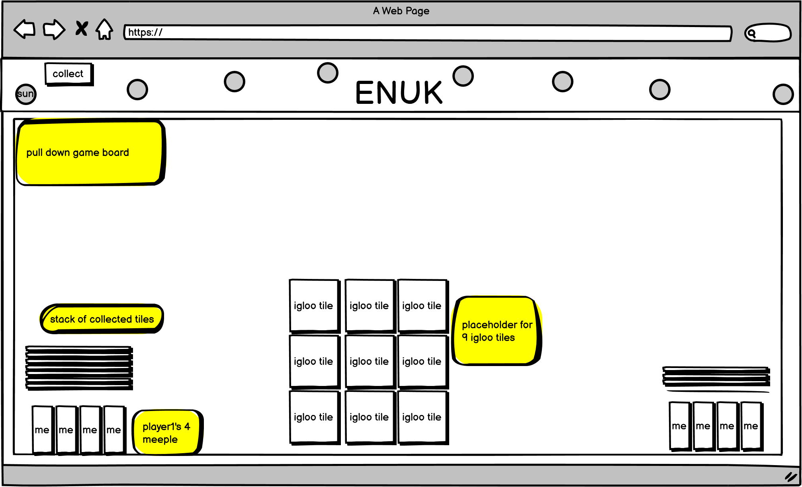
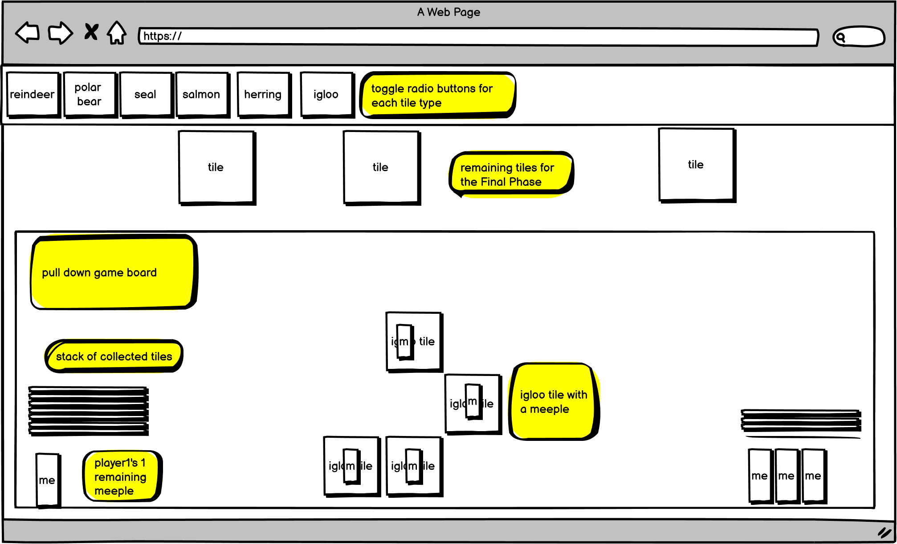
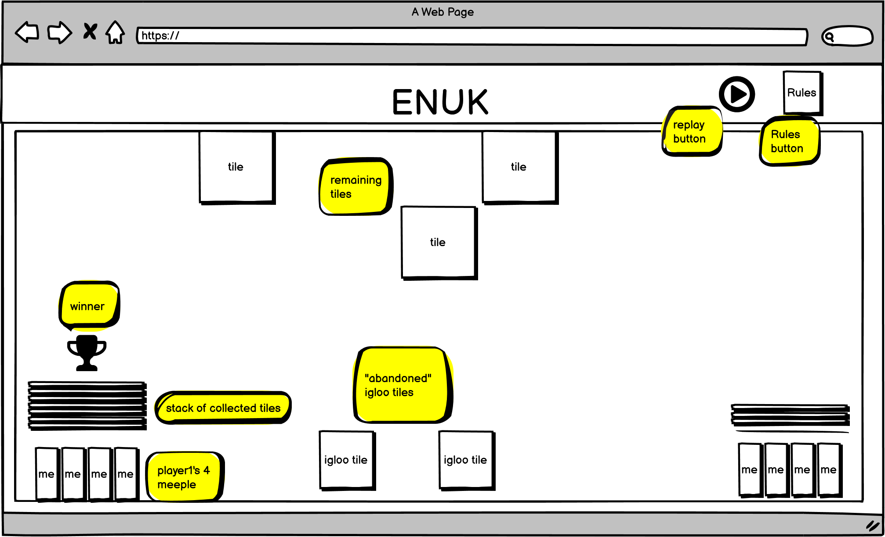

# [Enuk](https://ruszkipista.github.io/cims02-enuk/)
An interactive webpage to play [Enuk boardgame](https://dorra-spiele.de/enuk/) in a browser. This project is my second milestone in obtaining the [Full Stack Web Development](https://codeinstitute.net/full-stack-software-development-diploma/) diploma from [Code Institute](https://codeinstitute.net/)

<p style="text-align: center;"><a href="https://boardgamegeek.com/boardgame/36554/enuk" target="_blank"></a><p>

**Game Classification**
* Category: [ Animals, Children's Game, Memory ]
* Age - 5 years and up

#### Publisher's description:
The small Eskimo child Enuk is already excited. Today he may go with his large brothers on a journey into the ice. Finally he may see the wild polar bears on their way, watch the seals fishing and fish through the ice holes. He looks forward to building an igloo with the others. However, the day goes by too fast...

The children have to build the igloo and to observe as many animals as possible at the same time. Who collects the most animal tiles and builds the igloo successfully, will win!

#### Description of the mechanics:
Enuk is a mixture of memory and push-your-luck. Players turn over animal tiles, until they want to quit or one of the animals is scared and flees: the herring flee from the salmon, salmon flees from the seal, the seal flees from the polar bear and the polar bear flees from the Eskimo. How many tiles dare you turn over?


## Contents
- [1. UX design](#1-ux-design "1. UX design")
  - [1.1 Strategy Plane](#11-strategy-plane "1.1 Strategy Plane")
  - [1.2 Scope plane](#12-scope-plane "1.2 Scope plane")
  - [1.3 User Stories](#13-user-stories "1.3 User Stories")
  - [1.4 Structure plane](#14-structure-plane "1.4 Structure plane")
  - [1.5 Skeleton plane](#15-skeleton-plane "1.5 Skeleton plane")
  - [1.6 Surface plane](#16-surface-plane "1.6 Surface plane")
- [2. Program design](#2-program-design "2. Program design")
- [3. Features Left to Implement](#3-features-left-to-implement "3. Features Left to Implement")
- [4. Technologies and Tools Used](#4-technologies-and-tools-used "4. Technologies and Tools Used")
- [5. Issues solved during development](#5-issues-solved-during-development-and-testing "5. Issues solved during development and testing")
- [6. Testing](#6-testing "6. Testing")
- [7. Deployment](#7-deployment "7. Deployment")
- [8. Credits](#8-credits "8 Credits")
- [9. Disclaimer](#9-disclaimer "9. Disclaimer")

## 1. UX design
### 1.1 Strategy Plane
Stakeholders of the website:
- children from age 5 who want to play Arctic themed memory game in a browser
- adults letting children play on a computer
- game designers of the original board game

#### 1.1.1 Goals and Objectives of Stakeholders (users)
|G#|User|Goals, Needs, Objectives|
|--|----|------------------------|
|G1|child|wants to play on computer|
|G2|child|wants to be able to play without the need of adult constantly present or other players|
|G3|child|wants engaging game|
|G4|adult|the game should be educative|
|G5|adult|the game should be playable without reading skills|
|G6|designer|the computer game should preserve the original design, characters, rules as close as possible

### 1.2 Scope plane
It has been decided to create an interactive webpage written in HTML, CSS and JavaScript. The webpage will feature Enuk board game,  closely resembling the visual experience of the original game, enhanced with built-in rules and sound effects.

Note: Although much effort made to satisfy responsivity criteria, this game is playable on computer screen only. On other screens the tiles on the game area overflows on smaller screens, so the player needs to scroll and during scrolling in the brain the stored visual references of known tiles gets destroyed so the game degrades to a push-your-luck game which is not the intention of the desiger/artist/developer.

The following table lists the planned features, each feature referenced with original goal(s):

|F#|Goal|Feature|
|--|----|-------|
|F1|G5|Rules are explained separate from the game|
|F1|G5|The game play incorporates every rule, restricts actions and decision to the immediately available ones|
|F2|G2|moves and feedbacks in the game are graphical and audible, understandable without text|
|F3|G4|situations, characters, objects, sounds exists in nature|
|F4|G6|design and graphical elements are to be taken from original game|
|F5|G3|game is repeatable with variability and the challenge level is adjustable|

### 1.3 User Stories
* As a child I want to play a game on the computer, so I am entertained and challenged.
* As a child I want to play without an adult reading in-play instructions off the screen, so I am not dependent on others.
* As an adult I want a game for my child which can be played without help, so I can do something else.
* As an adult I want a game about arctic animals, so my child can learn about them and their relationships.
* As an adult I want a game with rules built into the game play, so my help is not needed during the play.
* As the original game designer, I want to see my product extended into digital space, so my recogition extends further.

### 1.4 Structure plane
The structure of the website to be built consist of a **Rules** and a **Game** page. The website loads the Rules page first, the Games page is accessible from the Rules page only. At the end of a game play the Rules page becomes accessible again. 

<p style="text-align: center;"><p>

### 1.5 Skeleton plane

<details>
  <summary>Features and Wireframe of Rules page</summary>

<h3>Rules page with Navbar and responsive Body of text and images and Input fields</h3>

|Section|Feature / Content description|
|--------------|-----------------------------|
|Navbar|ENUK logo|
|Navbar|start game button for linking to the Game page|
|Header|colorful summary about the game|
|Game Materials|Toggle Switch for sound on/off|
|Game Materials|Toggle Switch for test mode on/off|
|Game Materials|toggle radio buttons to chose own color|
|Game Materials|3 toggle buttons to chose number of opponents [0-3]|
|Game Materials|5 animal tiles with multipliers to show how many of them goes into the game|
|Game Materials|sliding meter [2-14] to select number of animal tiles from each type (bear,seal,salmon,herring)|
|Game Materials|sliding meter [3-9] to select number of sun positions on the board which is tied to the number of reindeer tiles|
|Game Materials|save chosen game parameters to browser's local storage at every user interactions for persistance|
|Game Materials|Read game parameters at page refresh and set up the input fields to the last saved state, so game can be repeated with same settings|
|Game Materials|game board, so it's structure can be explained|
|Game Materials|each of the 9 igloo tiles is a pice of a whole igloo. The image of the 9 igloo tiles helps to explain their placement on the board on the 3x3 placeholder area|
|Game Materials|figure explaining fleeing order, so the rule can be loaded into player's visual memory|
|Game Materials|for each player, placeholder for stack of collected tiles with 4 meeples underneath, so game state can be explained|
|First Phase|explain a small First Phase game play through several steps, illustrated with images|
|Rules of First Phase|explain detailed rules for First Phase illustrated with images|
|Finishing Phase|explain a short Finishing Phase game play through several steps, illustrated with images|
|Rules of Finishing Phase|explain detailed rules for Finishing Phase illustrated with images|
|End of the Game|rules for when the game ends|
|Credits|give credit to the authors of the original board game|

  <br>
  
</details>

#### there are 3 phases in the Game:
- flipping and collecting tiles, building the igloo
- player declares next tile before flipping it, if correct, collects the tile
- announcing the winner

<details>
  <summary>Features and wireframes of Game page during First Phase</summary>

  <h3>Game area with Navbar and Tiles</h3>

|Section|Feature / Content description|
|--------------|-----------------------------|
|Navbar|ENUK logo|
|Navbar|for First Phase, set up sun positions as circles as many were set on the Rules page as a parameter. The arrangement of the circles form an arc starting from left-bottom corner of the Navbar up to the top-horizontal midpoint and down to the right-bottom corner. The arc mimics the sun's low path over the horizon|
|Navbar|for First Phase, put up a sun icon into the left-most sun position and advance it (with animation) to the next (to right) when a player turns a reindeer tile|
|Navbar|put up an eskimo glove icon, so when player can indicate that they want to collect face-up tiles from the board, by clicking on this icon|
|Game area|change the background color of the game area to the actual player's color, so it is evident, who's turn it is|
|Game area|put up tiles face down onto the game area in rows in a grid structure. The number of each tile types are set by parameters from the Rules page. If the test parameter is On, label each tile so the tester can know what the tiles' backs are hiding. Every tile remaining on the area face-down retains their place, so the player can visually memorize their position. Every tile can be flipped back and forth (restricted by game rules)|
|Game area|when a player clicks on a face-down tile, flip the tile, revealing the face image, if sound is switched on, play a sound effect in sync with the flip animation|
|Game area|when a player flips an igloo tile, after the face image is revealed, the tile is moved to the board onto the igloo placeholder and a meeple is placed on top of this tile. The meeple is taken from underneath the player's stack (if there is left). If sound is switched on, play a sound effect in sync with the tile removal|
|Game area|each animal (except the reindeer) fears of one other animal: herring fears salmon, salmon fears seal, seal fears polar bear, polar bear fears reindeer (with eskimo), when player flips a tile, check if the flipped animal fears any face-up animals on the board OR any face-up animal fears the flipped animal. If there is fear, the fleeing animals's tile turned back face-down (with sound effect), remaining face-up tiles are removed to the player's stack (with sound effect)|
|Game area|if player clicks on the collect button (eskimo glove icon), remove the face-up tiles from board and move them into the player's stack (with sound effect)|

  <br>
  

  <h3>Game area with Navbar and temporary pull-down Board</h3>

|Section|Feature / Content description|
|--------------|-----------------------------|
|Navbar|if player hovers over the Navbar, bring the GameBoard forward, on top of the game area. If the hovering over the Navbar ends, push the board back into the background|
|Board| There is a 3x3 tile placeholder area for 9 igloo tiles in the mid-bottom of the board. The 9 igloo pieces gives out the whole igloo|
|Board|Each player to have a tile stack at the bottom of the board. A stack consists of tiles collected by the player, each collected tile is represented by a tile edge image, same way as in physical form. The height of the stacks are comparable visually between players. The stack grows upwards with each collected tile.|
|Board|Under each tile stack 4 meeples are stored in the player's color. If a player flips an igloo tile, the tile goes onto the 3x3 igloo placeholder grid at its right place. The tile is then covered with a meeple on top, taken from the player's stack. If there are no more meeples left for the player, then that tile will not be covered with meeple.|

  <br>
  
</details>


<details>
 <summary>Features and wireframe of Game page during Finishing Phase</summary>

|Section|Feature / Content description|
|--------------|-----------------------------|
|Navbar|ENUK logo|
|Navbar|put up 6 toggle radio buttons with icons of (reindeer, bear, seal, salmon, herring, igloo), so player can declare their prediction what their next flip will be|
|Board|if actual player has a meeple on a tile on the 3x3 igloo area, then that one meeple is removed from the tile a placed back under their stack and the tile is collected into their stack (with sound effect)
|Game area|upon receiving one meeple back into the stack, the player is allowed to make a prediction of their next flip by choosing a tile type in the Navbar. Clicking on a tile type gives out a sound effect, the tile type gets marked (they are radio buttons)|
|Game area|if player successfully predicts their next flip, the flipped tile is collected into their stack (with sound effect)|
|Game area|wrongly predicted and flipped tile remains face-up and can not be flipped again|

  <br>
  <h3>Game area covered with remaining tiles and pulled-down Board, </h3>
  
</details>


<details>
 <summary>Features and wireframe of Game page at the End Of Game Phase</summary>

<h3>Game area with Navbar and permanent pull-down Board</h3>

|Section|Feature / Content description|
|--------------|-----------------------------|
|Navbar|ENUK logo|
|Navbar|put up a Replay button, so player can restart the game immediatelly without changing the game parameters|
|Navbar|put up a Rules button, so player can go back to the Rules page for studying the rules or changing parameters|
|Board|Mark the winners stack with a crown, announce the end of the game with a sound effect|
|Board|bring forward the board, but remain 1 level below of the remaining tiles|
|Board|Make every tiles flippable|

  
</details>

### 1.6 Surface plane
Chose font [Roboto](https://fonts.google.com/specimen/Roboto) for the headers.

The images, tiles and icons are digital reproduction of the physical board game. Most of them are photgraphed and transformed in an image editor. This method preserves the original look and style.

Sound effect had been added to certain screen actions to give audio feedback.

## 2. Program design
The interactivity is provided with JavaScript program running in the browser on the client side. It has 3 theoretically distinct parts:
1. Viewer - responsible for visual representation of data and and game elements - governed by the UX design,
2. Model-Controller - responsible for logic and decisions in the game. It is abstracted away from the visual representation. Also responsible for triggering changes in the Viewer.

### 2.1 Generating HTML code with Viewer
The Rules page is a usual static HTML code styled with Bootstrap classes.
The Game page is built from HTML elements generated by JavaScript routines. The syling is done with CSS.

### 2.2 Pseudo code of Model-Controller

<details>
<summary>
The following states describe the game play stages from rendering the game board until declaring the winner.
</summary>

**A.** state <a id="A">**BeforePhase1**</a> (generate game area for Phase 1)
1. generate game table with 74 tiles face down, random order in matrix layout (rows and columns)
    - 9 `igloo` pieces
    - 14 `herring`
    - 14 `salmon`, 
    - 14 `seal`, 
    - 14 `polarbear`s, 
    - 9 `reindeer` (with eskimo)
2. generate game board with 
    - empty tile stack of player(s), 
    - 4 meeples for each player under their stack,
    - empty 3x3 tile holder over the igloo,
    - empty 3x3 meeple holder on top of the 3x3 tile holder
    - place the sun piece on the first of 9 positions
    - place invisible icons of `herring`, `salmon`, `seal`, `polarbear`, `reindeer`, `igloo`
3. determine order of player moves
4. set `ActualPlayer` to the first player
5. continue to state <a href="#B">**InPhase1-BeforeMove**</a>

**B.** state <a id="B">**InPhase1-BeforeMove**</a> (prepare actual player’s move)
1. instruct `ActualPlayer` to move (flip or collect)
2. wait for request

**C.** state <a id="C">**InPhase1-ProcessMove**</a> (collecting tiles and building the igloo)
-  receive move from `ActualPlayer` (`ClickedTile`, `Request`)
  1. If `Request` is `RequestToFlip` to flip a face-down tile up, then
     * -> set flag `RequestToFlip`
     * -> flip the tile face-up 
     * If `ClickedTile` is `reindeer` -> move the sun piece to the next position. if there is no next position (already on the final), then do not move sun
  2. If `Request` is `CollectTiles` to collect face-up tiles from table -> set flag `RequestToCollect`
  3. If `Request` is something else -> continue to state **InPhase1-BeforeMove**
  4. continue to state <a href="#D">**InPhase1-Evaluation**</a>

**D.** state <a id="D">**InPhase1-Evaluation**</a> (evaluate game state after move)
1. clear evaluation flags
2. check face-up tiles on table:
    - determine the list of animals fleeing from any other animal<br>
    ( rank order: `herring` < `salmon` < `seal` < `polarbear` < `reindeer`.<br>
    An animal flees from the next higher ranked animal only, e.g. `salmon` flees from `seal`, but not from `polarbear` or from any others)
    - If any flees -> set flag `AnimalFled`
    - determine the list of `igloo` tiles to be removed to the board
    - determine the list of other face-up tiles
3. If NOT flag `AnimalFled` AND all tiles are face-up -> set flags `EndOfPhase2`, `EndOfPhase1`
4. Else If `ClickedTile` is `reindeer` AND the sun piece is on the last position -> set flag `EndOfPhase1`
5. If flag `EndOfPhase1`<br>
OR flag `EndOfPhase2`<br>
OR `ClickedTile` is `igloo`<br>
OR flag `AnimalFled`<br>
OR flag `RequestToCollect`<br>
-> set flag `EndOfMove`
6. continue to state <a href="#E">**InPhase1-Execution**</a>

**E.** state <a id="E">**InPhase1-Execution**</a> (execute actions based on evaluation)
1. If `ClickedTile` -> wait some time that each player can memorize the last tile flip
2. turn tiles of fleeing animals back face-down
3. move `igloo` tiles onto the board's 3x3 igloo and mark each tile with the player's one (of 4) meeples under its stack. If there are no meeples left, do not mark.
4. If `EndOfMove` -> collect remaining face-up tiles into player’s stack
5. wait some time that each player can memorize the actions (if there was)
6. If flag `EndOfPhase2` -> continue to state <a href="#M">**EndOfGame**</a>
7. If flag `EndOfMove` -> set `ActualPlayer` to the next player
8. If flag `EndOfPhase1` -> continue to state <a href="#F">**BeforePhase2**</a>
9. Else continue to state <a href="#B">**InPhase1-BeforeMove**</a>

**F.** state <a id="F">**BeforePhase2**</a> (set up board for Phase 2)
1. set invisible the `CollectTiles` icon on board
2. set visible the icons for each tile type on the board for getting tile type declaration from players:<br>
(`herring`, `salmon`, `seal`, `polarbear`, `reindeer`, `igloo`)
3. continue to state <a href="#G">**InPhase2-CollectOneIgloo**</a>

**G.** state <a id="G">**InPhase2-CollectOneIgloo**</a> (collect one tile from the igloo)
1. If ActualPlayer hasn’t got meeple on igloo -> continue to state <a href="#K">**InPhase2-Evaluation**</a>
2. remove `ActualPlayer`’s one meeple from igloo
3. remove tile underneath the removed meeple and move it to the tile stack of the `ActualPlayer`
4. continue to state <a href="#H">**InPhase2-BeforeDeclaration**</a>

**H.** state <a id="H">**InPhase2-BeforeDeclaration**</a>
1. instruct ActualPlayer to declare its next flip, choose one of the following:<br>
(`herring`, `salmon`, `seal`, `polarbear`, `reindeer`, `igloo`)
2. wait for request

**I.** state <a id="I">**InPhase2-BeforeMove**</a>
1. instruct `ActualPlayer` to flip one tile
2. wait for request

**J.** state <a id="J">**InPhase2-ProcessMove**</a>
- receive move from player: (`ClickedElement` (Tile or Icon), `Request`)
1. If `Request` is `DeclareNextTileType` AND `ClickedElement` is valid:
   - -> set `Declaration`
   - -> mark `Declaration` on board
   - -> continue to state <a href="#I">**InPhase2-BeforeMove**</a>
2. If `Request` is to flip a face-down tile up AND `Declaration` is set
   - -> flag `RequestToFlip`
   - -> flip the clicked tile face-up
   - -> continue to state <a href="#K">**InPhase2-Evaluation**</a>
3. If `Declaration` is set -> continue to state <a href="#I">**InPhase2-BeforeMove**</a>
4. Else -> continue to state <a href="#H">**InPhase2-BeforeDeclaration**</a>

**K.** state <a id="K">**InPhase2-Evaluation**</a> (evaluate game state after move)
1. clear evaluation flags
2. If all tiles on table are face-up<br>
	OR `ClickedElement` tile is the last `reindeer`<br>
	OR there is no more meeple on the igloo<br>
->  set flag `EndOfPhase2`
3. If NOT `ClickedElement` tile -> set flag `EndOfMove`
4. Else If `ClickedElement` tile is the same as `Declaration` -> set flag `CorrectDeclaration`
5. Else -> set flag `EndOfMove`
6. continue to state <a href="#L">**InPhase2-Execution**</a>

**L.** state <a id="L">**InPhase2-Execution**</a> (execute actions based on evaluation)
1. If `ClickedElement` tile -> wait some time that each player can memorize the last tile flip
2. If flag `CorrectDeclaration` -> move tile `ClickedElement` to player’s stack
3. wait some time that each player can memorize the actions (if there was)
4. If flag `EndOfPhase2` -> continue to state <a href="#M">**EndOfGame**</a>
5. Else If flag `EndOfMove` -> set `ActualPlayer` to the next player
6. continue to state <a href="#G">**InPhase2-CollectOneIgloo**</a>

**M.** state <a id="M">**EndOfGame**</a>
1. Announce winner (most collected tiles)
2. Allow free tile flipping on tiles remaining on the table
3. Offer to restart the game
4. wait for request

**N.** state <a id="N">**EndOfGame-ProcessMove**</a>
- receive move from player: (`ClickedElement`, `Request`)
1. If `Request` is `RequestToRestart` -> continue to state <a href="#A">**BeforePhase1**<a>
2. If `Request` is `RequestToFlip` -> flip `ClickedElement`

</details>

## 3. Features Left to Implement
* develop a program agent for playing one player's part, so the human player and program agent take turns during the game until one wins
* integrate the program agent into the game play with same visualization as for human player, so the human player can follow the agent's move

## 4. Technologies and Tools Used

- The project's product (the website) was written in HTML, CSS and JavaScript, utilising [Bootstrap 5.0 Beta](https://getbootstrap.com/docs/5.0/) framework (which itself uses CSS and JavaScript). Bootstrap is used for its responsive utilities. 
- Manipulated images with program [Paint.NET](https://www.getpaint.net/). Mainly used for cropping, resizing, background removal and format conversion.
- downloaded [youtube](https://www.youtube.com/) videos with [youtube-dl](https://youtube-dl.org/)
- extracted and cut sound clips with [Audacity](https://www.audacityteam.org/)
- Created wireframes with program from [balsamiq](https://balsamiq.com/wireframes/)
- Written study notes on [Google Docs](https://docs.google.com/)
- Disassembled a PDF file with [Adobe Acrobat PRO](https://acrobat.adobe.com/ie/en/acrobat.html)
- Edited the code with [Visual Studio Code](https://code.visualstudio.com/), the page preview was provided via [Live Server](https://github.com/ritwickdey/vscode-live-server) VS Code extension.
- Managed code versions with [Git](https://git-scm.com/downloads)
- Stored the code and project deliverables cloud service [Github](https://github.com/) repository with versions.
- Deployed the website on [GitHub Pages](https://pages.github.com/)
- The development machine run [Windows 10](https://www.microsoft.com/en-us/software-download/windows10) operating system.
- The website was tested on desktop on [Chrome](https://www.google.com/intl/en_ie/chrome/) and [Firefox](https://www.mozilla.org/en-US/firefox/) web browsers, also on a [OnePlus2](https://www.oneplus.com/ie/support/spec/oneplus-2) mobile phone running [Android OS](https://www.android.com/) and mobile [Chrome](https://play.google.com/store/apps/details?id=com.android.chrome&hl=en) browser.
- Generated favicon with [Favicon & App Icon Generator](https://www.favicon-generator.org/)
- Generated one image (on top of this Readme) of how the website looks on different size devices with [Am I Responsive](http://ami.responsivedesign.is/)
- Chose font using [Google Fonts](https://fonts.google.com/)
- Run CSS code through [Autoprefixer CSS online](https://autoprefixer.github.io/) to supplement suggested vendor prefixes
- Searched the internet to find content, documentation and solution for issues using [Google](https://www.google.com)'s search service.
- connected to the internet using [Vodafone](https://n.vodafone.ie/shop/broadband.html)'s broadband service.

## 5. Issues solved during development and testing
See my [study notes/development journal](./assets/doc/ci-ms2-study-notes-journal.pdf) with lots of issues and bugs solved.

## 6. Testing

First step in testing was the validation of HTML, CSS and JS code with [Markup Validation Service](https://validator.w3.org/), [CSS Validation Service](https://jigsaw.w3.org/css-validator/), [JS Hint](https://jshint.com/) respectively. I performed the validations a couple of times during development and once at the end. Now all html pages validate to "Document checking completed. No errors or warnings to show.". The `style.css` file validates to "Congratulations! No Error Found." All 3 `*.js` file validates to one type of warning that variables are unknown or unused. They are due to the split of JavaScript code into three separate files.

The whole testing were conducted manually.

Here is a sample from the test log, see the complete document [here](./assets/doc/ci-ms2-testing.pdf)

```
Background: 
Desktop device is a desktop Windows 10 operating system running Chrome (on 1920x1080 pixels screen) and Firefox browser (on 1600x1200 pixels screen)
Mobile device is a OnePlus2 mobile phone running OxigenOS 3.6.1 (equivalent to Android 6.0.1) and Chrome Mobile browser on screen resolution 1080x1920 pixels

User Story:

Scenario: 
```
|Test no.|Pre-condition|Event|Expected|Result|Comment|
|-|-|-|-|-|-|
|1|on Desktop Chrome,|pass|-|

The website performs on desktop and mobile devices as intended, no responsivity issues were found.

No additional bugs were discovered during the final testing.

## 7. Deployment
### Deployment to GitHub Pages
The website is deployed to GitHub Pages automatically by GitHub. The assigned web address is [ruszkipista.github.io/cims01-lkc/](https://ruszkipista.github.io/cims01-lkc/).
I followed [this](https://docs.github.com/en/github/working-with-github-pages/configuring-a-publishing-source-for-your-github-pages-site) tutorial to deploy the project on GitHub Pages, these were the steps:
1. On GitHub navigate to the repository's main page
2. Under your repository name, click Settings

3. Under "GitHub Pages", use the None or Branch drop-down menu and select a publishing source

4. Optionally, use the drop-down menu to select a folder for your publishing source

5. Click Save

6. After a while you are presented whith this status message at the same place


### Deployment to a different hosting solution
If you want to deploy this project to a different hosting solution, you need to copy all the files from this repository. Follow the repository cloning steps from [this](https://docs.github.com/en/github/creating-cloning-and-archiving-repositories/cloning-a-repository) tutorial.
After you have your local copies of these files, you copy them into the home folder of the webserver, keeping the folder structure as is.
Just because this is a static website, you can even start up the Home page by double clicking on the `index.html` file in your local file system - effectively launching you default browser with the starting page.

## 8. Credits
### Boardgame Designers
* [Stefan Dorra](https://boardgamegeek.com/boardgamedesigner/13/stefan-dorra)
* [Manfred Reindl](https://boardgamegeek.com/boardgamedesigner/10614/manfred-reindl)
### Boardgame Artist
* [Alexander Jung](https://boardgamegeek.com/boardgameartist/12123/alexander-jung)
### Boardgame Publishers
* [Queen Games](https://boardgamegeek.com/boardgamepublisher/47/queen-games)
* [Piatnik](https://boardgamegeek.com/boardgamepublisher/22/piatnik)

### Acknowledgements
My inspiration for this project came from the assessment booklet mentioning memory game as a possible project and this board game jumped into my mind immediatelly. We played this game with our kids many times, even recently during the [pandemic](https://en.wikipedia.org/wiki/COVID-19_pandemic) lockdown.

I thank [Nishant Kumar](https://github.com/nishant8BITS) for mentoring me during the project. He suggested to make the gameboard stowaway so all tiles can be accessed without scrolling and emphasize the Play button on the Rules page.

My family had several suggestions on the UI and how to avoid the use of written information during play.

[Victor Navas Santajuana](https://www.linkedin.com/in/victor-navas-santajuana-229a2b67/) gave me a code rewiew half way through the project

### Media
See the exact source of images in the code comments. Here is the short list of sources:
- BoardGameGeek's [webpage](https://boardgamegeek.com/boardgame/36554/enuk) about the game, especially this [pdf](https://boardgamegeek.com/filepage/33267/english-rules-enuk),
- my own photos of the boardgame's board, tiles, meeples
- youtube videos for sound effects, see the list of sources in [`gameviewer.js`](./assets/js/gameviewer.js)

## 9. Disclaimer
The content of this website is for entertainment and educational purposes only.