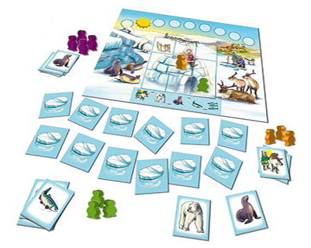
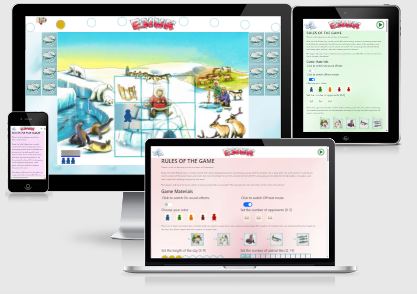
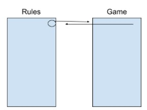
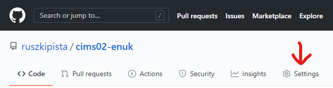
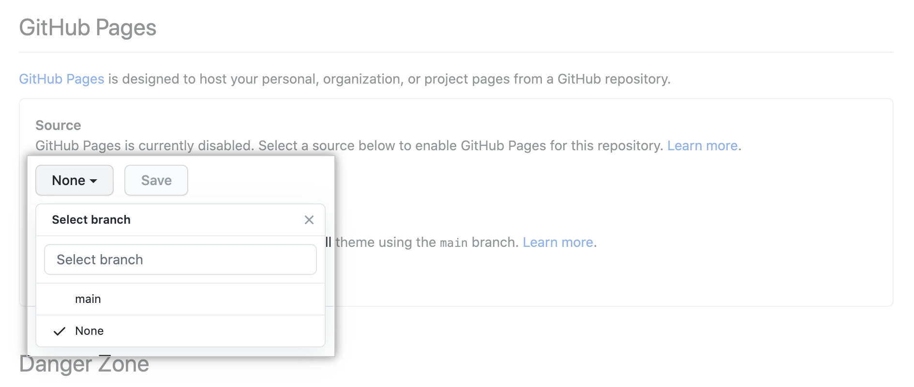
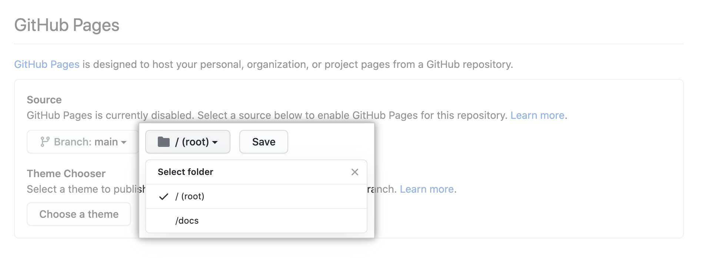
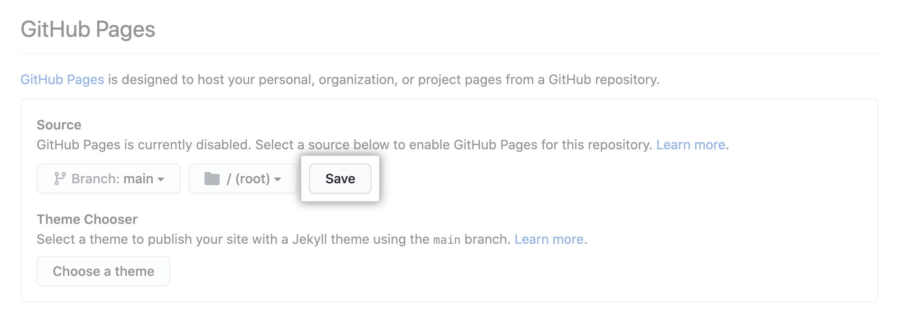
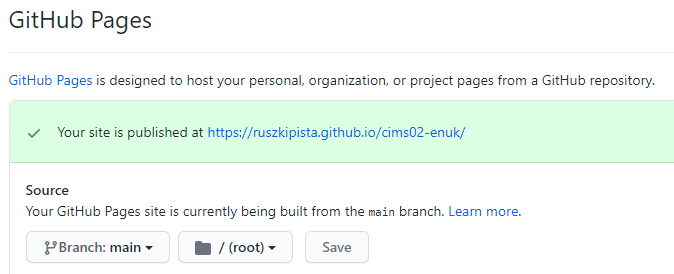

# [Enuk](https://ruszkipista.github.io/cims02-enuk/)
An interactive webpage to play [Enuk boardgame](https://dorra-spiele.de/enuk/) in a browser. This project is my second milestone in obtaining the [Full Stack Web Development](https://codeinstitute.net/full-stack-software-development-diploma/) diploma from [Code Institute](https://codeinstitute.net/)

[](https://boardgamegeek.com/boardgame/36554/enuk)

**Game Classification**
* Category
  - Animals 
  - Children's Game 
  - Memory
* Age - 5 years and up

#### Publisher's description:
The small Eskimo child Enuk is already excited. Today he may go with his large brothers on a journey into the ice. Finally he may see the wild polar bears on their way, watch the seals fishing and fish through the ice holes. He looks forward to building an igloo with the others. However, the day goes by too fast...

The children have to build the igloo and to observe as many animals as possible at the same time. Who collects the most animal tiles and builds the igloo successfully, will win!

#### Description of the mechanics:
Enuk is a mixture of memory and push-your-luck. Players turn over animal tiles, until they want to quit or one of the animals is scared and flees: the herring flee from the salmon, salmon flees from the seal, the seal flees from the polar bear and the polar bear flees from the Eskimo. How many tiles dare you turn over?



### Attention assessor!
I kept a journal during the development about my daily activities, see it [here](./assets/doc/ci-ms2-study-notes-journal.pdf) frozen in time or [live](https://docs.google.com/document/d/1eooOU-uZVoeEShXQkXs86pQumJEob1c4Pa6hwJqahNw/edit?usp=sharing).

## Contents
- [1. UX design](#1-ux-design "1. UX design")
  - [1.1 Strategy Plane](#11-strategy-plane "1.1 Strategy Plane")
  - [1.2 Scope plane](#12-scope-plane "1.2 Scope plane")
  - [1.3 User Stories](#13-user-stories "1.3 User Stories")
  - [1.4 Structure plane](#14-structure-plane "1.4 Structure plane")
  - [1.5 Skeleton plane](#15-skeleton-plane "1.5 Skeleton plane")
  - [1.6 Surface plane](#16-surface-plane "1.6 Surface plane")
- [2. Program design](#2-program-design "2. Program design")
- [3. Features Left to Implement](#3-features-left-to-implement "3. Features Left to Implement")
- [4. Technologies and Tools Used](#4-technologies-and-tools-used "4. Technologies and Tools Used")
- [5. Issues solved during development](#5-issues-solved-during-development "5. Issues solved during development")
- [6. Testing](#6-testing "6. Testing")
- [7. Deployment](#7-deployment "7. Deployment")
- [8. Credits](#8-credits "8 Credits")
- [9. Disclaimer](#9-disclaimer "9. Disclaimer")

## 1. UX design
### 1.1 Strategy Plane
Stakeholders of the website:
- player

#### 1.1.1 Goals and Objectives of Stakeholders (users)
|G#|User|Goals, Needs, Objectives|
|--|----|------------------------|
|G1|.|.|

### 1.2 Scope plane
It has been decided to create an interactive website.

The following table lists the planned features, each feature referenced with original goal(s):

|F#|Goal|Feature|
|--|----|-------|
|.|.|.|

### 1.3 User Stories
* As a player

### 1.4 Structure plane
The structure of the website to be built consist of
- a **Home** page,



### 1.5 Skeleton plane
Feature list in page/section structure with content hinting and navigation links. The following table is a sample, describes the page **XXX**. Check out the whole list [here](./assets/doc/ci-ms2-features.pdf) in PDF format.

|Page / *section*|Feature#|Feature / Content description|Link or Action|
|--------------|--------|-----------------------------|--------------|
|.|.|.|.|

Created wireframes for **XXX** page in 3 width, see the others as well [here](./assets/doc/ci-ms2-wireframes.pdf) or the balsamiq file [here](./assets/doc/ci-ms2-wireframes.bmpr).

### 1.6 Surface plane
Chose font [Roboto](https://fonts.google.com/specimen/Roboto) for the headers.

## 2. Program design
The interactivity is provided with JavaScript program running in the browser on the client side. It has 3 theoretically distinct parts:
1. Viewer - responsible for visual representation of data and and game elements - governed by the UX design,
2. Model - responsible for logic and decisions in the game. It is abstracted away from the visual representation,
3. Controller - responsible for connecting the Model and Viewer code parts together.

### 2.1 Generating HTML code with Viewer

### 2.2 Pseudo code of Controller
there are 2 phases in the game:
- Phase 1: flipping and collecting tiles, building the igloo
- Phase 2: player declares next tile before flipping it, if correct, collects the tile

The following statuses represent the stages the game play goes through from rendering the game board until declaring the winner.

**A.** status <a id="A">**BeforePhase1**</a> (generate game area for Phase 1)
1. generate game table with 74 tiles face down, random order in matrix layout (rows and columns)
    - 9 `igloo` pieces
    - 14 `herring`
    - 14 `salmon`, 
    - 14 `seal`, 
    - 14 `polarbear`s, 
    - 9 `reindeer` (with eskimo)
2. generate game board with 
    - empty tile stack of player(s), 
    - 4 meeples for each player under their stack,
    - empty 3x3 tile holder over the igloo,
    - empty 3x3 meeple holder on top of the 3x3 tile holder
    - place the sun piece on the first of 9 positions
    - place invisible icons of `herring`, `salmon`, `seal`, `polarbear`, `reindeer`, `igloo`
3. determine order of player moves
4. set `ActualPlayer` to the first player
5. continue to status <a href="#B">**InPhase1-BeforeMove**</a>

**B.** status <a id="B">**InPhase1-BeforeMove**</a> (prepare actual player’s move)
1. instruct `ActualPlayer` to move (flip or collect)
2. wait for request

**C.** status <a id="C">**InPhase1-ProcessMove**</a> (collecting tiles and building the igloo)
-  receive move from `ActualPlayer` (`ClickedTile`, `Request`)
  1. If `Request` is `RequestToFlip` to flip a face-down tile up, then
     * -> set flag `RequestToFlip`
     * -> flip the tile face-up 
     * If `ClickedTile` is `reindeer` -> move the sun piece to the next position. if there is no next position (already on the final), then do not move sun
  2. If `Request` is `CollectTiles` to collect face-up tiles from table -> set flag `RequestToCollect`
  3. If `Request` is something else -> continue to status **InPhase1-BeforeMove**
  4. continue to status <a href="#D">**InPhase1-Evaluation**</a>

**D.** status <a id="D">**InPhase1-Evaluation**</a> (evaluate game state after move)
1. clear evaluation flags
2. check face-up tiles on table:
    - determine the list of animals fleeing from any other animal<br>
    ( rank order: `herring` < `salmon` < `seal` < `polarbear` < `reindeer`.<br>
    An animal flees from the next higher ranked animal only, e.g. `salmon` flees from `seal`, but not from `polarbear` or from any others)
    - If any flees -> set flag `AnimalFled`
    - determine the list of `igloo` tiles to be removed to the board
    - determine the list of other face-up tiles
3. If NOT flag `AnimalFled` AND all tiles are face-up -> set flags `EndOfPhase2`, `EndOfPhase1`
4. Else If `ClickedTile` is `reindeer` AND the sun piece is on the last position -> set flag `EndOfPhase1`
5. If flag `EndOfPhase1`<br>
OR flag `EndOfPhase2`<br>
OR `ClickedTile` is `igloo`<br>
OR flag `AnimalFled`<br>
OR flag `RequestToCollect`<br>
-> set flag `EndOfMove`
6. continue to status <a href="#E">**InPhase1-Execution**</a>

**E.** status <a id="E">**InPhase1-Execution**</a> (execute actions based on evaluation)
1. If `ClickedTile` -> wait some time that each player can memorize the last tile flip
2. turn tiles of fleeing animals back face-down
3. move `igloo` tiles onto the board's 3x3 igloo and mark each tile with the player's one (of 4) meeples under its stack. If there are no meeples left, do not mark.
4. If `EndOfMove` -> collect remaining face-up tiles into player’s stack
5. wait some time that each player can memorize the actions (if there was)
6. If flag `EndOfPhase2` -> continue to status <a href="#M">**EndOfGame**</a>
7. If flag `EndOfMove` -> set `ActualPlayer` to the next player
8. If flag `EndOfPhase1` -> continue to status <a href="#F">**BeforePhase2**</a>
9. Else continue to status <a href="#B">**InPhase1-BeforeMove**</a>

**F.** status <a id="F">**BeforePhase2**</a> (set up board for Phase 2)
1. set invisible the `CollectTiles` icon on board
2. set visible the icons for each tile type on the board for getting tile type declaration from players:<br>
(`herring`, `salmon`, `seal`, `polarbear`, `reindeer`, `igloo`)
3. continue to status <a href="#G">**InPhase2-CollectOneIgloo**</a>

**G.** status <a id="G">**InPhase2-CollectOneIgloo**</a> (collect one tile from the igloo)
1. If ActualPlayer hasn’t got meeple on igloo -> continue to status <a href="#K">**InPhase2-Evaluation**</a>
2. remove `ActualPlayer`’s one meeple from igloo
3. remove tile underneath the removed meeple and move it to the tile stack of the `ActualPlayer`
4. continue to status <a href="#H">**InPhase2-BeforeDeclaration**</a>

**H.** status <a id="H">**InPhase2-BeforeDeclaration**</a>
1. instruct ActualPlayer to declare its next flip, choose one of the following:<br>
(`herring`, `salmon`, `seal`, `polarbear`, `reindeer`, `igloo`)
2. wait for request

**I.** status <a id="I">**InPhase2-BeforeMove**</a>
1. instruct `ActualPlayer` to flip one tile
2. wait for request

**J.** status <a id="J">**InPhase2-ProcessMove**</a>
- receive move from player: (`ClickedElement` (Tile or Icon), `Request`)
1. If `Request` is `DeclareNextTileType` AND `ClickedElement` is valid:
   - -> set `Declaration`
   - -> mark `Declaration` on board
   - -> continue to status <a href="#I">**InPhase2-BeforeMove**</a>
2. If `Request` is to flip a face-down tile up AND `Declaration` is set
   - -> flag `RequestToFlip`
   - -> flip the clicked tile face-up
   - -> continue to status <a href="#K">**InPhase2-Evaluation**</a>
3. If `Declaration` is set -> continue to status <a href="#I">**InPhase2-BeforeMove**</a>
4. Else -> continue to status <a href="#H">**InPhase2-BeforeDeclaration**</a>

**K.** status <a id="K">**InPhase2-Evaluation**</a> (evaluate game state after move)
1. clear evaluation flags
2. If all tiles on table are face-up<br>
	OR `ClickedElement` tile is the last `reindeer`<br>
	OR there is no more meeple on the igloo<br>
->  set flag `EndOfPhase2`
3. If NOT `ClickedElement` tile -> set flag `EndOfMove`
4. Else If `ClickedElement` tile is the same as `Declaration` -> set flag `CorrectDeclaration`
5. Else -> set flag `EndOfMove`
6. continue to status <a href="#L">**InPhase2-Execution**</a>

**L.** status <a id="L">**InPhase2-Execution**</a> (execute actions based on evaluation)
1. If `ClickedElement` tile -> wait some time that each player can memorize the last tile flip
2. If flag `CorrectDeclaration` -> move tile `ClickedElement` to player’s stack
3. wait some time that each player can memorize the actions (if there was)
4. If flag `EndOfPhase2` -> continue to status <a href="#M">**EndOfGame**</a>
5. Else If flag `EndOfMove` -> set `ActualPlayer` to the next player
6. continue to status <a href="#G">**InPhase2-CollectOneIgloo**</a>

**M.** status <a id="M">**EndOfGame**</a>
1. Announce winner (most collected tiles)
2. Allow free tile flipping on tiles remaining on the table
3. Offer to restart the game
4. wait for request

**N.** status <a id="N">**EndOfGame-ProcessMove**</a>
- receive move from player: (`ClickedElement`, `Request`)
1. If `Request` is `RequestToRestart` -> continue to status <a href="#A">**BeforePhase1**<a>
2. If `Request` is `RequestToFlip` -> flip `ClickedElement`

### 2.3 Pseudo code of machine player model


## 3. Features Left to Implement


## 4. Technologies and Tools Used

- The project's product (the website) was written in HTML, CSS and JavaScript, utilising [Bootstrap 5.0 Beta](https://getbootstrap.com/docs/5.0/) framework (which itself uses CSS and JavaScript). Bootstrap is used for its responsive utilities. 
- Manipulated images with program [Paint.NET](https://www.getpaint.net/). Mainly used for cropping, resizing, background removal and format conversion.
- Created wireframes with program from [balsamiq](https://balsamiq.com/wireframes/)
- Written study notes on [Google Docs](https://docs.google.com/)
- Disassembled a PDF file with [Adobe Acrobat PRO](https://acrobat.adobe.com/ie/en/acrobat.html)
- Edited the code with [Visual Studio Code](https://code.visualstudio.com/), the preview was provided via [Live Server](https://github.com/ritwickdey/vscode-live-server) VS Code extension.
- Managed code versions with [Git](https://git-scm.com/downloads)
- Stored the code and project deliverables cloud service [Github](https://github.com/) repository with versions.
- Deployed the website on [GitHub Pages](https://pages.github.com/)
- The development machine run [Windows 10](https://www.microsoft.com/en-us/software-download/windows10) operating system.
- The website was tested on desktop on [Chrome](https://www.google.com/intl/en_ie/chrome/) and [Firefox](https://www.mozilla.org/en-US/firefox/) web browsers, also on a [OnePlus2](https://www.oneplus.com/ie/support/spec/oneplus-2) mobile phone running [Android](https://www.android.com/) and mobile [Chrome](https://play.google.com/store/apps/details?id=com.android.chrome&hl=en) browser.
- Generated favicon with [Favicon & App Icon Generator](https://www.favicon-generator.org/)
- Generated one image (on top of this Readme) of how the website looks on different size devices with [Am I Responsive](http://ami.responsivedesign.is/)
- Chose font using [Google Fonts](https://fonts.google.com/)
- Run CSS code through [Autoprefixer CSS online](https://autoprefixer.github.io/) to supplement suggested vendor prefixes
- Searched the internet to find content, documentation and solution for issues using [Google](www.google.com)'s search service.
- connected to the internet using [Vodafone](https://n.vodafone.ie/shop/broadband.html)'s broadband service.

## 5. Issues solved during development
### 5.1 X


## 6. Testing

First step in testing was the validation of HTML, CSS and JS code with [Markup Validation Service](https://validator.w3.org/), [CSS Validation Service](https://jigsaw.w3.org/css-validator/) [JS Hint](https://jshint.com/) respectively. I performed the validations a couple of times during development and once at the end. Now all html pages validate to "Document checking completed. No errors or warnings to show.". The `style.css` file validates to "Congratulations! No Error Found." `The script.js` validates to a couple of readibility warnings which I chose to ignore.

The whole testing were conducted manually.

Here is a sample from the test log, see the complete document [here](./assets/doc/ci-ms2-testing.pdf)

```
Background: 
Desktop device is a desktop Windows 10 operating system running Chrome (on 1920x1080 pixels screen) and Firefox browser (on 1600x1200 pixels screen)
Mobile device is a OnePlus2 mobile phone running OxigenOS 3.6.1 (equivalent to Android 6.0.1) and Chrome Mobile browser on screen resolution 1080x1920 pixels

User Story:

Scenario: 
```
|Test no.|Pre-condition|Event|Expected|Result|Comment|
|-|-|-|-|-|-|
|1|on Desktop Chrome,|pass|-|

The website performs on desktop and mobile devices as intended, no responsivity issues were found.

No additional bugs were discovered during the final testing.

## 7. Deployment

The website is deployed to GitHub Pages automatically by GitHub. The assigned web address is [ruszkipista.github.io/cims01-lkc/](https://ruszkipista.github.io/cims01-lkc/).
I followed [this](https://docs.github.com/en/github/working-with-github-pages/configuring-a-publishing-source-for-your-github-pages-site) tutorial to deploy the project on GitHub Pages, these were the steps:
1. On GitHub navigate to the repository's main page
2. Under your repository name, click Settings

3. Under "GitHub Pages", use the None or Branch drop-down menu and select a publishing source

4. Optionally, use the drop-down menu to select a folder for your publishing source

5. Click Save

6. After a while you are presented whith this status message at the same place


If you want to deploy this project to a different hosting solution, you need to copy all the files from this repository. Follow the repository cloning steps from [this](https://docs.github.com/en/github/creating-cloning-and-archiving-repositories/cloning-a-repository) tutorial.
After you have your local copies of these files, you copy them into the home folder of the webserver, keeping the folder structure as is.
Just because this is a static website, you can even start up the Home page by double clicking on the `index.html` file in your local file system - effectively launching you default browser with the starting page.

## 8. Credits
### Boardgame Designers
* [Stefan Dorra](https://boardgamegeek.com/boardgamedesigner/13/stefan-dorra)
* [Manfred Reindl](https://boardgamegeek.com/boardgamedesigner/10614/manfred-reindl)
### Boardgame Artist
* [Alexander Jung](https://boardgamegeek.com/boardgameartist/12123/alexander-jung)
### Boardgame Publishers
* [Queen Games](https://boardgamegeek.com/boardgamepublisher/47/queen-games)
* [Piatnik](https://boardgamegeek.com/boardgamepublisher/22/piatnik)

### Acknowledgements
My inspiration for this project came from the assessment booklet mentioning memory game as a possible project and this board game jumped into my mind immediatelly. We played this game with our kids many times, even recently during the [pandemic](https://en.wikipedia.org/wiki/COVID-19_pandemic) lockdown.

I thank [Nishant Kumar](https://github.com/nishant8BITS) for mentoring me during the project. He suggested to make the gameboard stowaway so all tiles can be accessed without scrolling.

My family had sevaeral suggestion on the UI and how to avoid using text on the game board during play.

### Media
See the exact source of images in the code comments. Here is the short list of sources:
- BoardGameGeek's [webpage](https://boardgamegeek.com/boardgame/36554/enuk) about the game, especially this [pdf](https://boardgamegeek.com/filepage/33267/english-rules-enuk),
- my own photos of the boardgame's board, tiles, meeples

## 9. Disclaimer
The content of this website is for educational purposes only.